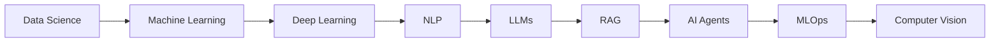

  
  

## About Me

I am **Ahmed Osrof**, a Data Science and Artificial Intelligence student focused on building practical, reliable, and human-centered AI systems. My work combines data analysis, machine learning, deep learning, natural language processing, retrieval-augmented generation, and production-oriented engineering.

I enjoy turning complex ideas into useful products: from multimodal document intelligence and Arabic-oriented applications to predictive modeling and MLOps workflows. I am especially interested in solutions that remain useful in real-world environments with limited resources and connectivity.

> **Current direction:** RAG systems, multimodal AI, LLM applications, model evaluation, MLOps, and production-ready machine-learning services.

## Highlights

| Focus | What I build |
|---|---|
| **Applied AI** | Intelligent applications that connect data, models, and user needs. |
| **Machine Learning** | Predictive models, feature engineering, evaluation, and analytical pipelines. |
| **Generative AI** | LLM applications, prompt engineering, embeddings, vector search, and RAG. |
| **Engineering** | APIs, data workflows, deployment foundations, and maintainable project structure. |

## Achievements

### First-Place Hackathon Winner — Team GOAI

Contributed to **GOAI**, a smart delivery ecosystem designed to improve transportation and delivery access in Gaza. The concept combined bicycle and car delivery, a marketplace for local stores, and delivery-management capabilities in one practical platform.

## Global Hackathon Project — MentalLoad

Worked on **MentalLoad**, an AI-powered concept focused on helping people understand and reduce mental fatigue caused by intensive use of AI tools. The system explores user responses, free-text input, fatigue estimation, AI recommendations, and next-day workload prediction.

## Technical Toolkit

### Data Science and Machine Learning

`Python` · `Pandas` · `NumPy` · `Scikit-learn` · `Matplotlib` · `Seaborn` · `Feature Engineering` · `Model Evaluation` · `Predictive Modeling`

### Deep Learning and Computer Vision

`PyTorch` · `TensorFlow` · `Neural Networks` · `Model Training` · `Model Optimization` · `OpenCV` · `Computer Vision`

### Generative AI and LLM Applications

`LLMs` · `RAG` · `AI Agents` · `LangChain` · `Embeddings` · `Vector Databases` · `ChromaDB` · `FAISS` · `Hugging Face` · `Prompt Engineering` · `OpenAI API`

### MLOps and Deployment

`FastAPI` · `Docker` · `MLflow` · `CI/CD` · `Model Serving` · `Production ML Systems` · `Cloud AI Deployment`

## Featured Projects

| Project | Description |
|---|---|
| [**Multimodal OCR RAG Capstone**](https://github.com/Ahmedosrf/Multimodal-OCR-RAG-Capstone) | Multimodal document intelligence for PDFs, scanned documents, images, tables, OCR, FAISS, and LLM-based question answering. |
| [**WalletWise**](https://github.com/Ahmedosrf/WalletWise) | Arabic-oriented personal and family expense assistant with a practical, offline-first direction. |
| [**Gaza Hunger Prediction App**](https://github.com/Ahmedosrf/gaza-hunger-prediction-app) | Streamlit application for hunger-risk prediction, data analysis, and accessible ML experimentation. |
| [**MLOps Qafza**](https://github.com/Ahmedosrf/MLOps-Qafza) | Data ingestion, relational validation, and structured delivery of ML-ready data. |
| [**Causal Impact Analysis**](https://github.com/Ahmedosrf/causal_impact_project) | Analysis of the effect of price reductions on daily revenue using causal methods. |
| [**ROS 2 Maze Navigation**](https://github.com/Ahmedosrf/ros2-maze-navigation) | Autonomous maze navigation using Artificial Potential Fields, ROS 2, and Gazebo. |

## Learning Roadmap

## GitHub Statistics

  
  
  

  

## Contribution Snake

  <picture>
    <source media="(prefers-color-scheme: dark)" srcset="https://raw.githubusercontent.com/Ahmedosrf/Ahmedosrf/gh-pages/github-contribution-grid-snake-dark.svg" />
    <source media="(prefers-color-scheme: light)" srcset="https://raw.githubusercontent.com/Ahmedosrf/Ahmedosrf/gh-pages/github-contribution-grid-snake.svg" />
    
  </picture>

## Connect

  <a href="https://github.com/Ahmedosrf">GitHub</a> ·
  <a href="https://www.linkedin.com/in/ahmed-osrf-bb8457356">LinkedIn</a>

**Building practical AI systems from ideas to reality.**

---

  Designed and maintained by Ahmed Osrof.

<!-- Profile README for Ahmedosrf -->
<!-- Contribution Snake is generated by .github/workflows/snake.yml -->
<!-- The statistics section intentionally uses stable badges instead of paused third-party cards. -->

<!--
References:
[1]: https://github.com/Ahmedosrf
[2]: https://www.linkedin.com/in/ahmed-osrf-bb8457356
-->

[1]: https://github.com/Ahmedosrf "Ahmedosrf GitHub profile"
[2]: https://www.linkedin.com/in/ahmed-osrf-bb8457356 "Ahmed Osrof on LinkedIn"
